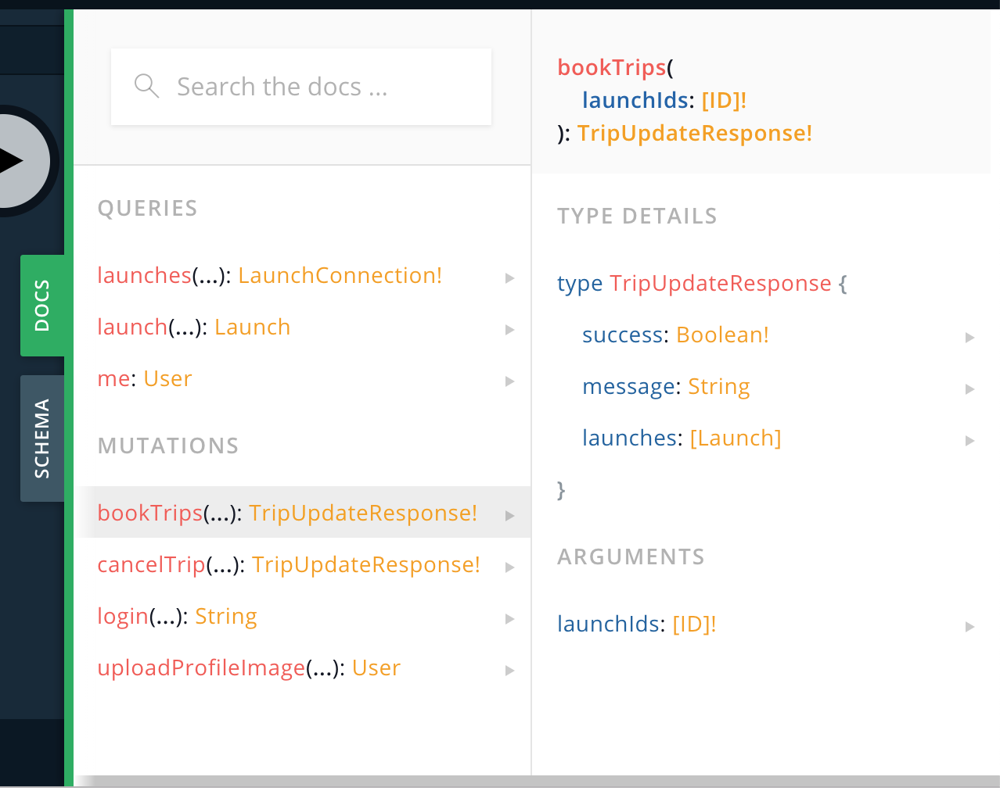
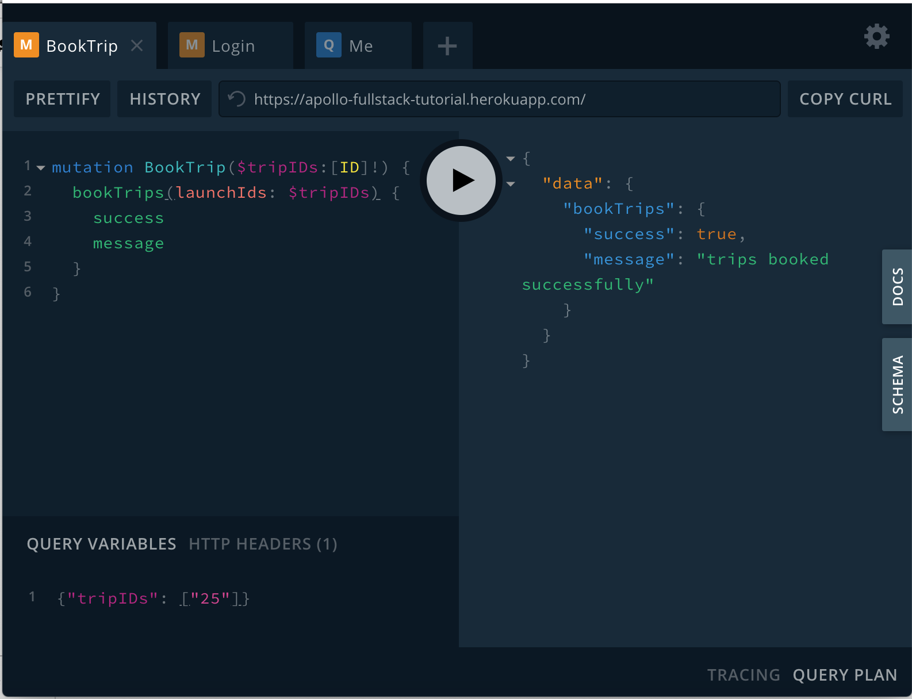
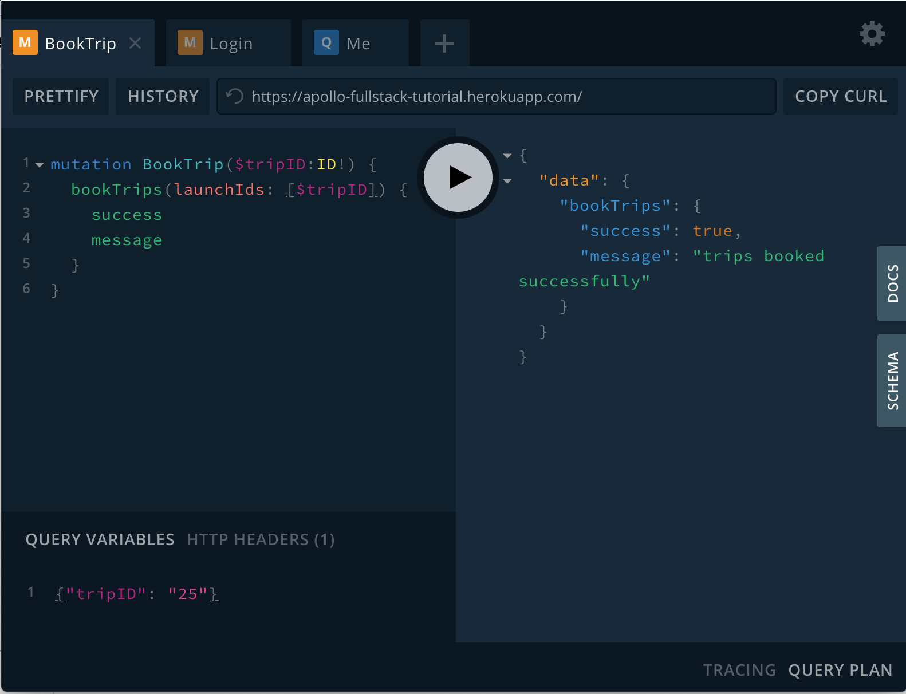

In this tutorial, you'll learn how to build authenticated mutations and handle information returned from those mutations, and use that knowledge to book and cancel some trips for yourself. 

## Adding authentication handling

Before you start booking, you need to be able to pass your authentication token along to Apollo. To do that, you'll dig a little deeper into how the Apollo client works. 

If you need to do anything before a request hits the and after Apollo has done most of the configuration for you, there's a delegate protocol called `HTTPNetworkTransportPreflightDelegate` which will allow you to do that. 

Open `Network.swift` and add an extension to conform to that delegate: 

```swift:title=Network.swift
extension Network: HTTPNetworkTransportPreflightDelegate { 

}
```

You'll get an error telling you that protocol stubs must be implemented, and asking you if you want to fix this. Click "Fix."


Two protocol methods will be added: `networkTransport(_:shouldSend:)` and `networkTransport(_:willSend:)`. 

The `shouldSend` method is called to allow you to make sure a request should go out to the network all. This is useful for things like checking that your user is logged in before trying to make a request. 

However, you're not going to be using that functionality in this application. Update the method to have it return `true` all the time.

```swift:title=Network.swift  
func networkTransport(_ networkTransport: HTTPNetworkTransport, 
                      shouldSend request: URLRequest) -> Bool {
	return true
}
```

The `willSend` request is the last thing which can manipulate the request before it goes out to the network. Since the request is passed as an `inout` variable, you can manipulate its contents directly. 

Update the `willSend` method to add your token as the value for the `Authorization` header: 

```swift:title=Network.swift
func networkTransport(_ networkTransport: HTTPNetworkTransport, 
                      willSend request: inout URLRequest) {
  let keychain = KeychainSwift()
  if let token = keychain.get(LoginViewController.loginKeychainKey) {
    request.addValue(token, forHTTPHeaderField: "Authorization")
  } // else do nothing
}
```

Next, you need to make sure that Apollo knows that this delegate exists. In order to do that, you need to do a step that so far, the Apollo client has been doing for you under the hood: Instantiating the `HTTPNetworkTransport`, which is the default way of talking to your server.

In the primary declaration of `Network`, update your `lazy var` to create this transport and set the `Network` object as its delegate, then pass it through to the `ApolloClient`: 

```swift:title=Network.swift
private(set) lazy var apollo: ApolloClient = {
  let httpNetworkTransport = HTTPNetworkTransport(url: URL(string: "https://apollo-fullstack-tutorial.herokuapp.com/")!, 
                                                  delegate: self)
        
  return ApolloClient(networkTransport: httpNetworkTransport)
}()
```

Click on the line numbers to add a breakpoint at the line where you're instantiating the `Keychain`: 


Build and run the application. Whenever a network request goes out, that breakpoint should now get hit. Now if you're logged in, your token will be sent to the server whenever you make a request. 

Now it's time to book a trip! 🚀

## Adding the booking mutation

In GraphiQL, open the Docs tab and take a look at the `bookTrips` mutation:



You can book multiple trips at once, then get back a `success` boolean indicating whether the booking succeeded, a `message` string to display to the user, and a list of `launches` the current user has booked. 

Start by adding a basic mutation in GraphiQL that passes in an array of trip identifiers, and then asks for the `success` and `message` back from the server: 

```graphql:title=(GraphiQL)
mutation BookTrips($tripIDs:[ID]!) {
  bookTrips(launchIds:$tripIDs) {
    success
    message
  }
}
```

In the `Query Variables` section of GraphiQL, add an array of identifiers - in this case, we'll use a single identifier to book one trip:

```json:title=(GraphiQL)
{"tripIDs": ["25"]}
```

In the `HTTP Headers` section of GraphiQL, add an authorization header to pass through the token you received when you logged in:

```json:title=(GraphiQL)
{ "Authorization" :"(your token)"}
```

Now, click the play button to run your authorized query in GraphiQL. You'll get back information regarding the trips (or in this case, trip) you've just booked. 

> Note: If you receive an error that says "Cannot read property 'id' of null", that means your user was not found based on the token you passed through. Make sure your authorization header is properly formatted and that you're actually logged in!



With a mutation written like this, you could book any number of trips you want at the same time! However, the booking mechanism in our application will only let you book one trip at a time.

Luckily, there's an easy way to update the mutation so it's required to only take a single object. Update your mutation to take a single `$tripID`, then pass an array containing that `$tripID` to the `bookTrips` mutation: 

```graphql:title=(GraphiQL)
mutation BookTrip($tripID:ID!) {
  bookTrips(launchIds:[$tripID]) {
    success
    message
  }
}
```

This is helpful because the Swift code generation will now generate a method which only accepts a single ID rather than an array, but you'll still be calling the same mutation under the hood, without the backend needing to change anything. 

In the `Query Variables` section of GraphiQL, update variables to use `tripID` as the key, and remove the array brackets from around the identifier: 

```json:title=(GraphiQL)
{"tripID":"25"}
```

Click the play button to run your updated query in GraphiQL. The response you get back should identical to the one you got earlier:



Now that you've fleshed out your query, it's time to put it into the app. Go to **File > New > File... > Empty**, and name this file `BookTrip.graphql`. Paste in the final query from GraphiQL. 

In `DetailViewController.swift`, add a new method to book your trip based on the flight's ID:

```swift:title=DetailViewController.swift
private func bookTrip(with id: GraphQLID) {
  Network.shared.apollo.perform(mutation: BookTripMutation(id: id)) { [weak self] result in
    guard let self = self else {
      return 
    }
    switch result {
    case .success(let graphQLResult):
      if let bookingResult = graphQLResult.data?.bookTrips {
        // TODO
      }

      if let errors = graphQLResult.errors {
        self.showAlertForErrors(errors)
      }
    case .failure(let error):
      self.showAlert(title: "Network Error",
                     message: error.localizedDescription)
    }
  }
}
```


Update the `cancelTrip` method to also take the flight's ID: 

```swift:title=DetailViewController.swift
private func cancelTrip(with id: GraphQLID) {
  print("Cancel trip \(id)")
}
```

Next, update the `bookOrCancelTapped` method to use the two methods you've just added instead of printing: 

```swift:title=DetailViewController.swift
if launch.isBooked {
  self.cancelTrip(with: launch.id)
} else {
  self.bookTrip(with: launch.id)
}
```

In `bookTrip`, replace the `TODO` with code to handle what comes back in the `success` property: 


```swift:title=DetailViewController.swift
if bookingResult.success {
  self.showAlert(title: "Success!",
							   message: bookingResult.message ?? "Trip booked successfully")
} else {
  self.showAlert(title: "Could not book trip", 
							   message: bookingResult.message ?? "Unknown failure.")
}
```


## Adding the Cancel mutation

Now, the process will be similar for the `cancelTrip` mutation. Go back to GraphiQL and look at the `


```swift:title=DetailViewController.swift
Network.shared.apollo.perform(mutation: CancelTripMutation(id: id)) { [weak self] result in
  guard let self = self else {
    return
  }
  switch result {
  case .success(let graphQLResult):
    if let cancelResult = graphQLResult.data?.cancelTrip {
      if cancelResult.success {
        // TODO
      }

    if let errors = graphQLResult.errors {
      self.showAlertForErrors(errors)
    }
  case .failure(let error):
    self.showAlert(title: "Network Error",
                   message: error.localizedDescription)
  }
}
```


In `cancelTrip`, replace the `TODO` with code to handle what comes back in that mutation's `success` property: 

```swift:title=DetailViewController.swift
if cancelResult.success {
  self.showAlert(title: "Trip cancelled",  
                 message: cancelResult.message ?? "Your trip has been officially cancelled.")
} else {
  self.showAlert(title: "Could not cancel trip", 
                 message: cancelResult.message ?? "Unknown failure.")
}
```

## Forcing a fetch from the network

Update the `loadLaunchDetails` method to take a parameter to determine if it should force reload, as well. 

If it should force reload, update the cache policy from the default `.returnCacheDataElseFetch`, which will return data from the cache if it exists, to `.fetchIgnoringCacheCompletely` which  will force the network to go out and 

```swift:title=DetailViewController.swift
private func loadLaunchDetails(forceReload: Bool = false) {
  guard
    let launchID = self.launchID,
    (forceReload || launchID != self.launch?.id) else {
      // This is the launch we're alrady displaying, or the ID is nil.
      return
  }
        
  let cachePolicy: CachePolicy
  if forceReload {
    cachePolicy = .fetchIgnoringCacheCompletely
  } else {
    cachePolicy = .returnCacheDataElseFetch
  } 
        
  Network.shared.apollo.fetch(query: LaunchDetailsQuery(id: launchID), cachePolicy: cachePolicy) { [weak self] result in
    // Rest of this remains the same
  }
}
```

Add the following to both the `bookingResult.success` and `cancelResult.success` branches in their respective methods:

```swift:title=DetailViewController.swift
self.loadLaunchDetails(forceReload: true)
``` 

## Summary

Next, you'll learn more about how to get details in a reusable fashion and how to work with the cache directly in [Fragments and Cache Manipulation](./tutorial-fragments-and-cache).